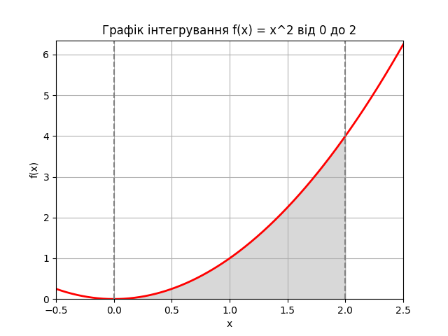

# woolf-algo-hw-10

# Завдання 2: Обчислення визначеного інтеграла методом Монте-Карло

## Опис завдання
Завдання полягає в обчисленні значення інтеграла функції \( f(x) = x^2 \) на інтервалі \([0, 2]\) методом Монте-Карло. Результат, отриманий цим методом, порівнюється з аналітичним значенням інтегралу та значенням, отриманим за допомогою функції `quad` з підмодуля `integrate` бібліотеки SciPy.

## Результати

### Метод Монте-Карло
Метод Монте-Карло: 2.669483234405076

### Функція `quad`
Функція `quad`: 2.666666666666667 (похибка 2.960594732333751e-14)

### Аналітичний результат
Аналітичний результат: 2.6666666666666665

## Висновки
Метод Монте-Карло показує результат, який дуже близький до аналітичного і результату, отриманого за допомогою функції `quad`. Це підтверджує правильність і точність методу Монте-Карло при достатньо великій кількості випадкових точок.

Розбіжність між результатами є мінімальною і може бути зменшена збільшенням кількості випадкових точок в методі Монте-Карло.

## Опис графіка
На графіку зображено функцію \( f(x) = x^2 \) на інтервалі від -0.5 до 2.5. Область під кривою між x = 0 та x = 2 заштрихована сірим кольором, що відповідає області інтегрування. Червона лінія представляє графік функції. Вертикальні пунктирні лінії на x = 0 та x = 2 показують межі інтегрування. Цей графік допомагає візуалізувати область, значення якої обчислюється методом Монте-Карло та іншими методами.

